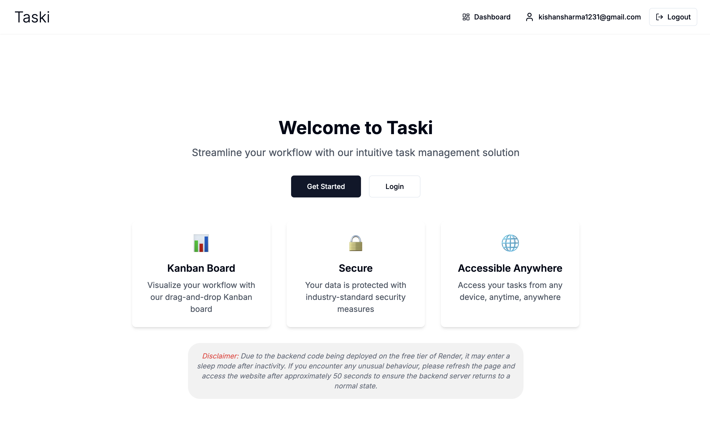
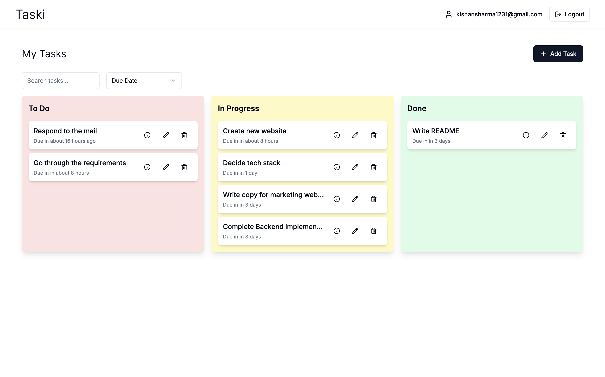
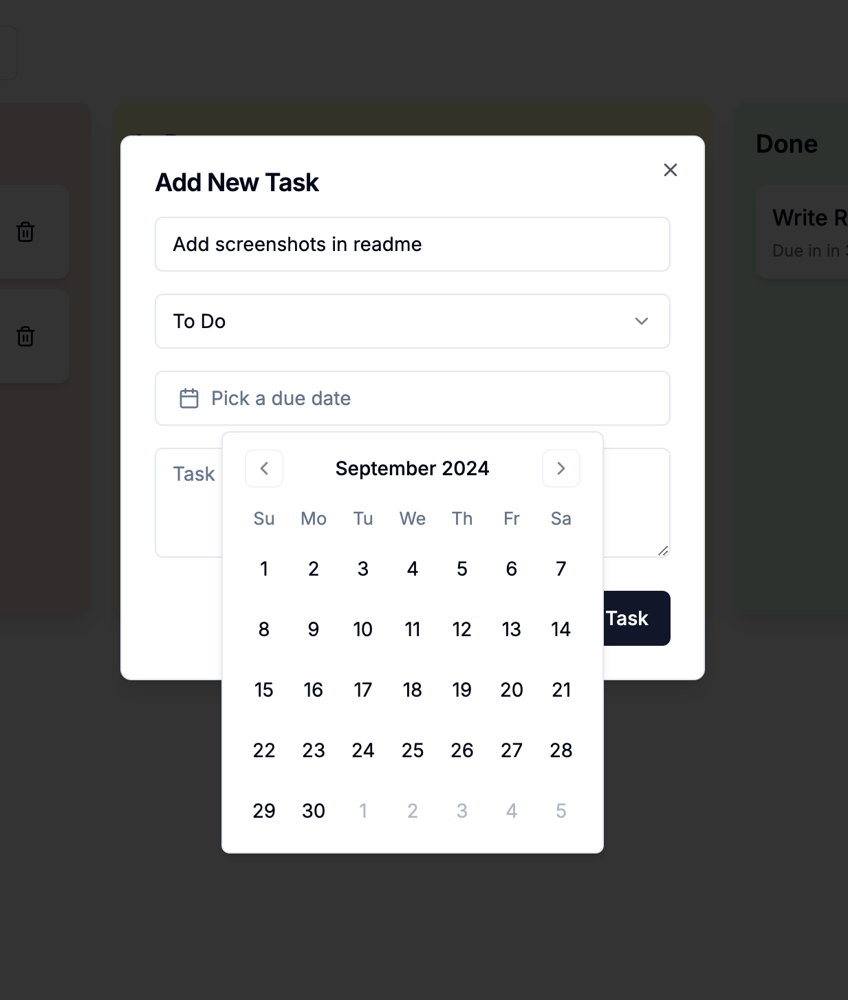

# Task Manager Application

## Overview
This Task Manager is a full-stack web application built with a Next.js frontend and an Express.js backend. It allows users to create, organize, and manage tasks across different stages of completion.
## Screenshots
- Home page

- Dashboard

- Add task

## Features
- User authentication (register, login). Google OAuth sign-in
- Create, read, update, and delete tasks
- Add due dates to tasks.
- Drag-and-drop interface for task management. Quickly move tasks between different stages of completion.
- Search tasks by title.
- Sort tasks by due date, creation date, and title.
- Responsive design for various screen sizes. Works well on mobile, tablet, and desktop.
- Clean UI with sleek animations.
- Super fast navigation.

## Tech Stack and reasons for choosing them
- Frontend:
  - Next.js
    - Provides SSR support
    - Good ecosystem for building React applications
  - React
    - Good ecosystem for building UI components
  - TypeScript
  - Tailwind CSS
    - Makes styling easier and faster
    - Since it's utility-first, it's easy to customize and maintain
  - react-beautiful-dnd (@hello-pangea/dnd)
    - To implement drag-and-drop functionality
    - Used the forked version to support latest React versions since the original package is not maintained anymore.
  
- Backend:
  - Express.js
  - TypeScript
  - PostgreSQL with Drizzle ORM, hosted on Neon
    - The best all-in-one database 
    - Drizzle ORM is simple and easy-to-use, and lot faster than other ORMs. Good TypeScript support.
    - Neon, since it was the only free PostgreSQL hosting service that I could find easily.
  - Bun
    - Fast all-in-one JavaScript runtime
    - Comes with many useful features out of the box
    - Good DX

- Authentication:
  - NextAuth.js (frontend)
  - Custom JWT implementation (backend)

## Prerequisites
- PostgreSQL database
- Bun

## Setup

### Backend
1. Navigate to the backend directory:
   ```
   cd backend
   ```
2. Install dependencies:
   ```
   bun install
   ```
3. Set up your environment variables:
   - Copy `.env.example` to `.env`
   - Fill in your database URL and JWT secret
4. Run database migrations:
   ```
    bun run db:generate
    bun run db:migrate
   ```
5. Start the development server:
   ```
   bun run dev
   ```

### Frontend
1. Navigate to the frontend directory:
   ```
   cd website
   ```
2. Install dependencies:
   ```
   bun install
   ```
3. Set up your environment variables:
   - Copy `.env.local.example` to `.env.local`
   - Fill in your backend API URL and NextAuth settings
4. Start the development server:
   ```
   bun run dev
   ```

## Usage
1. Open your browser and go to `http://localhost:3000`
2. Register a new account or log in
3. Start managing your tasks!
